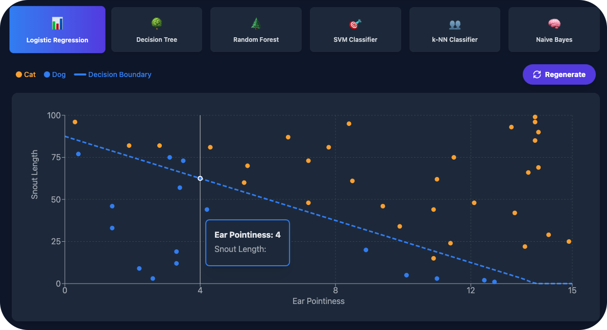

<div align="center">
  




[](https://reactjs.org/)
[](https://tailwindcss.com/)
[](https://recharts.org/)
[](https://vitejs.dev/)

  <br />

[View Demo](https://regress.techangelx.com/) • [Report Bug](#) • [Request Feature](#)
</div>

---

## About the Project

**Regressify** is an educational web application that makes machine learning models easier to understand through interactive visualisations. It covers both **regression** (predicting continuous values) and **classification** (predicting categories), allowing users to see how different algorithms approach the same problem.

### Inspiration

This project was inspired by auditing a Master's module in *Introduction to Machine Learning* at UCL. I created it as a visual “cheat sheet” to quickly reference how different ML models behave and to identify the best scenarios in which to apply them. Regressify bridges the gap between theoretical maths and practical application.

### Why Regressify?

* **Visual learning:** Watch models fit data live, not in static textbook diagrams.
* **Two learning modes:** Explore both regression and classification problems.
* **Real-world datasets:** Salary prediction, house prices, car values, and hiring decisions.
* **No black box:** Every model includes explanations, maths notation, and real-world analogies.
* **Dark/light mode:** Easy on the eyes, day or night.

---

## Features

### Two Learning Modes

| Mode               | What It Does               | Example Use Cases                             |
| ------------------ | -------------------------- | --------------------------------------------- |
| **Regression**     | Predicts continuous values | Salary, house prices, car value, plant growth |
| **Classification** | Predicts categories        | Hired/rejected, spam/not spam, pass/fail      |

### Regression Models (8 Algorithms)

| Model                     | Best For                 | Visual Pattern               |
| ------------------------- | ------------------------ | ---------------------------- |
| **Linear Regression**     | Simple trends            | Straight diagonal line       |
| **Polynomial Regression** | Career growth curves     | Smooth curve that flattens   |
| **Decision Tree**         | Clear rules, HR bands    | Horizontal steps/stairs      |
| **Random Forest**         | Robustness, complex data | Smoother averaged steps      |
| **Gradient Boosting**     | High precision           | Tight, error-correcting fit  |
| **SVM**                   | High dimensions, margins | Smooth, stiff “tube”         |
| **k-Nearest Neighbours**  | Local similarity         | Jagged, reactive line        |
| **Neural Network**        | Hidden patterns          | Wavy curve with oscillations |

**Available datasets:**

* Salary prediction (experience vs salary)
* House prices (square footage vs price)
* Car value (age vs depreciation)
* Plant growth (time vs height)
* Meme adoption (virality over time)
* Custom (create your own)

### Classification Models (6 Algorithms)

| Model                    | Best For            | Decision Style             |
| ------------------------ | ------------------- | -------------------------- |
| **Logistic Regression**  | Probability outputs | Straight decision boundary |
| **Decision Tree**        | Explainable rules   | Axis-aligned splits        |
| **Random Forest**        | Robust predictions  | Ensemble voting            |
| **SVM Classifier**       | Clear margins       | Maximum-margin boundary    |
| **k-Nearest Neighbours** | Local patterns      | Neighbourhood voting       |
| **Naive Bayes**          | Text, fast training | Probabilistic independence |

**Available dataset:**

* Hiring prediction (experience + skill score → hired/rejected)

---

## Interactive Features

* **Regenerate noise:** Re-roll random variance to see which models overfit vs stay robust.
* **Outlier visualisation:** Highlighted data points with tooltip backstories (e.g. “The Rockstar Junior”).
* **Live chart updates:** Click any model to see predictions instantly.
* **Maths badges:** Displays the underlying mathematical notation for each algorithm.
* **Educational panels:** Pros, cons, “How it works”, and when to use each model.
* **Dark/light theme:** Toggle with persistent user preference.

### Model Information Cards

Every selected model includes:

* **Mathematical notation** (e.g. `y = mx + c`)
* **How it works** (plain-English explanation)
* **When to use it** (best scenarios)
* **Real-world analogy**
* **Pros and cons** at a glance

---

## Tech Stack

| Technology            | Purpose                             |
| --------------------- | ----------------------------------- |
| **React 19**          | UI framework with hooks and context |
| **Recharts 3**        | React charting library              |
| **Tailwind CSS 3**    | Utility-first styling               |
| **Vite 7**            | Fast build tool                     |
| **JavaScript (ES6+)** | Clean, modular architecture         |

### Project Structure

```text
regressify/src
├── App.css
├── App.jsx
├── assets
│   └── react.svg
├── components
│   ├── ClassificationTab.jsx
│   ├── CurvatureTuner.jsx
│   ├── RegressionTab.jsx
│   └── shared
│       ├── MiniChart.jsx
│       ├── ModelDescription.jsx
│       ├── ParameterCard.jsx
│       └── Tooltips.jsx
├── context
│   └── ThemeContext.jsx
├── data
│   ├── classificationModels.js
│   └── regressionModels.js
├── index.css
└── main.jsx

```


## Getting Started
### Prerequisites

* Node.js 18+
* npm

### Installation

```bash
git clone https://github.com/YOUR_USERNAME/regressify.git

cd regressify
npm install
npm run dev
```

The app will be available at **[http://localhost:5173](http://localhost:5173)**.

### Build for Production

```bash
npm run build
npm run preview
```

---

## Usage

1. Choose a mode: Regression or Classification.
2. Select a dataset or create custom data.
3. Click a model to watch it fit the data instantly.
4. Read the explanation to understand its behaviour.
5. Regenerate noise to test robustness.
6. Toggle between light and dark mode.

---

## Roadmap

* [ ] Import custom CSV data (Analyze your own datasets)
* [ ] Add more classification datasets
* [ ] Export charts as images
* [ ] Add clustering algorithms (unsupervised learning)
* [ ] Mobile‑responsive improvements
* [ ] Model comparison mode (side‑by‑side)

---

## Contributing

Contributions are welcome. Feel free to open an issue or submit a pull request.
## Licence

Distributed under the MIT Licence. See `LICENCE` for more information.

<br />
<br />

<div>
  <a href="https://techangelx.com" target="_blank">
    
  </a>
  <span style="margin-left: 15px; vertical-align: middle; font-size: 1.4em; font-weight: 300;">
    Built by Ricki Angel • <a href="https://techangelx.com" target="_blank" style="text-decoration: none; color: inherit;">Tech Angel X</a>
  </span>
</div>
