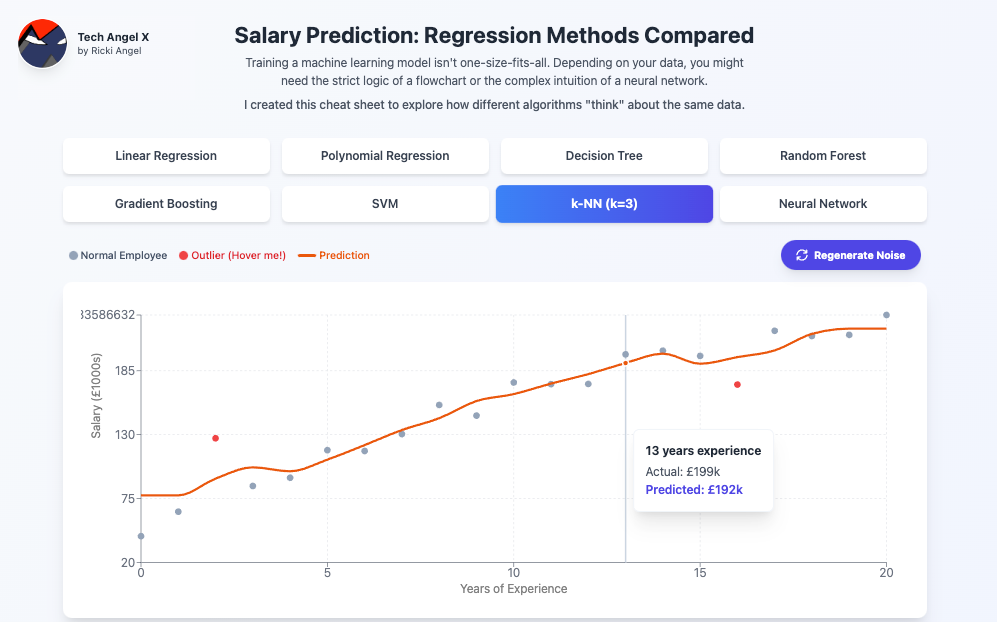

# Regressify

### Interactive Regression Visualisation Tool

A visual salary prediction tool comparing regression methods, to help students and developers understand machine learning algorithms through real-world scenarios.

<div align="center">



<br/>

[](https://reactjs.org/)
[](https://tailwindcss.com/)
[](https://recharts.org/)
[](https://vitejs.dev/)

[View Demo](https://regress.techangelx.com/) • [Report Bug](#) • [Request Feature](#)

</div>

---

## About The Project
**Regressify** is an educational web application that makes machine learning regression models easy to understand through interactive visualisations.  
 It depicts standard regression algorithms—including Linear Regression, Polynomial Regression, Decision Trees, and Neural Networks—and features an interactive Noise Generator to demonstrate model variance and robustness.

Inspiration: This project was inspired by auditing the Master’s degree module COMP0088: Introduction to Machine Learning at UCL, taught by Dr. Matthew Caldwell. I created it as a visual "cheat sheet" to quickly reference how different ML models behave and identify the best scenarios to apply them. Regressify was built to bridge the gap between theoretical math and practical application - exactly where I'm at.

Built for students, educators, and data science enthusiasts, it demonstrates how different algorithms "think" about the same data.

### Why Regressify?

- **Visual Learning**: See how 8 different models fit the same dataset in real-time.
- **Real-World Context**: Uses realistic salary data with natural variation (±£10k noise).
- **Storytelling Outliers**: Visualises how models react to anomalies like "The Rockstar Junior" or "The Stagnant Senior".
- **No Black Box**: Every model includes detailed explanations, math notation ($y=mx+c$), and real-world analogies.

---

## Features

### Eight Regression Models Compared

| Model | Best For | Visual Pattern |
|-------|----------|----------------|
| **Linear Regression** | Simple trends | Straight diagonal line |
| **Polynomial Regression** | Career growth curves | Smooth curve that flattens |
| **Decision Tree** | Clear rules, HR bands | Horizontal steps/stairs |
| **Random Forest** | Robustness, complex data | Smoother, averaged steps |
| **Gradient Boosting** | High precision tables | Tight fit, error-correcting |
| **SVM** | High dimensions, margin | Smooth, stiff "tube" |
| **k-NN** | Local similarity | Jagged, reactive line |
| **Neural Network** | Hidden patterns | Wavy curve with oscillations |

### Interactive Features

- **Regenerate Noise** - A dedicated button to re-roll random variance, visually demonstrating which models overfit (jump around) vs. which are robust (stay steady).
- **Outlier Visualisation** - Special red data points represent anomalies with tooltip backstories (e.g., "Hired by Crypto Startup").
- **Live Chart Updates** - Click any model to see predictions instantly.
- **Math Badges** - Displays the underlying mathematical notation for each algorithm.
- **Educational Content** - Pros, cons, and "How it Works" breakdowns for every model.

---

## Tech Stack

- **React 18** - Modern UI framework with hooks and `useMemo` for performance.
- **Vite** - Lightning-fast build tool.
- **Tailwind CSS 3** - Utility-first styling for a clean, academic aesthetic.
- **Recharts** - Composable charting library (ComposedChart for mixed Line/Scatter layers).
- **JavaScript (ES6+)** - Clean, modular architecture separating data logic from UI.

---

## Getting Started

### Prerequisites

- Node.js 16+ and npm installed

### Installation

```bash
# Clone the repository
git clone [https://github.com/YOUR_USERNAME/regressify.git](https://github.com/YOUR_USERNAME/regressify.git)

# Navigate to project directory
cd regressify

# Install dependencies
npm install

# Start development server
npm run dev
